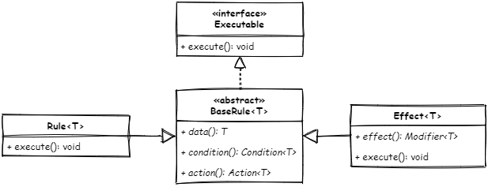

[](https://opensource.org/licenses/MIT)

# rulify

## What is rulify? 🤔

Some time ago I had the challenge of mapping a defined set of rules. That was
the birth of _rulify_.

_rulify_ itself is a framework that provides a framework for the implementation
of rules. A rule is an abstract representation of exactly one condition, which
is followed by an action. In other words, a rule describes an if-then structure.

The special feature of _rulify_ is that both conditions and actions can be
created independently of the rule, so that they can be reused several times in
different rules.

The library does not claim to fulfil the criteria of a rule engine, nor to
replace it.

## How _rulify_ works? 🔨

Rulify offers two classes which can be used as a start for the implementation of
a rule.



1. A `Rule` will evaluate a `Condition` and perform the provided `Action`
2. An `Effect` will evaluate a `Condition`, modify the data with the given
   `Modifier` and run lastly the provided `Action`.

A `Rule` or `Effect` always works with data provided by your own implementation.
This data must be managed by a single object, which is ideally a POJO.

## How to get started with _rulify_? 🎆

All you need is a POJO and a custom implementation of a `Rule` or a `Effect`
and implement the mandatory methods. Let's say there is our POJO `Cat` that
looks like

```java
public class Cat {

    private String name = "Meow 🐱";
    private boolean cute;

    public Cat(boolean isCute) { this.cute = isCute; }

    public void setName(String name) { this.name = name; }

    public boolean isCute() { return cute; }

    public void purr() { System.out.println("🐱 + ", name); }
}
```

Now we need your `Rule` which will run on the `Cat`.

```java
public class CatRule extends Rule<Cat> {

    @Override
    public Cat data() { return new Cat(true); }

    @Override
    public Condition<Cat> condition() { return Cat::isCute; }

    @Override
    public Action<Cat> action() { return Cat::purr; }
}
```

The last part is to execute the `Rule`.

```java
Executable rule = new CatRule();
rule.execute();
```

## What are the benefits of _rulify_?

The first and main advantage of this library compared to what actually? In 
my opinion, there two groups to which _rulify_ can be compared.

### Benefits compared to plain If-Then implementations

### Benefits compared to any rule engine