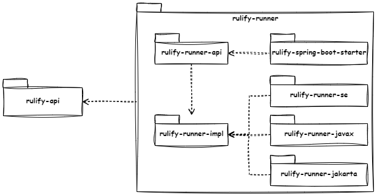

# rulify

[](https://opensource.org/licenses/MIT)
[](https://codecov.io/gh/faltfe/rulify)
[](https://github.com/faltfe/rulify/actions/workflows/build-test-coverage.yml)

## What is rulify? 🤔

Some time ago I had the challenge of mapping a some business rules into code. I
was not satisfied with existing libraries because they were either to complex
and had to many features or the implementation was not intuitiv for me. That was
the birth of _rulify_.

_rulify_ itself is a library that provides a framework for implementing
business rules as code. A rule is an abstract representation of exactly one 
condition, which is followed by an action. In other words, a rule describes 
an _if-then_ structure.

The special feature of _rulify_ is that both conditions and actions can be
created independently of the rule, so that they can be reused several times in
different rules.

** ‼ The library does not claim to fulfil the criteria of a rule engine, 
nor to replace it. ‼**

## How _rulify_ works? 🔨

When working with Maven import the dependency

```xml
<dependency>
    <groupId>de.faltfe.rulify</groupId>
    <artifactId>rulify-api</artifactId>
    <version>1.0.0</version>
</dependency>
```

_rulify_ offers two classes which can be used as a start for the implementation
of a rule.

1. A `Rule` will evaluate a `Condition` and perform the provided `Action`
2. An `Effect` will evaluate a `Condition`, modify the data with the given
   `Modifier` and run lastly the provided `Action`.


A `Rule` or `Effect` always works with data provided by your own implementation.
This data must be managed by a single object, which is ideally a POJO.

---

<p style="text-align: center;">
    <a href="https://faltfe.github.io/rulify/" target="_blank">
        🛑 <strong>For more information read the detail documentation.</strong> 🛑
    </a>
</p>

---

## How to get started with _rulify_? 🎆

All you need is a POJO and a custom implementation of a `Rule` or a `Effect`
and implement the mandatory methods. Let's say there is our POJO `Cat` that
looks like

```java
public class Cat {

    // Setter and Getter omitted for simplicity
    private String name = "Meow 🐱";
    private boolean cute;

    public Cat(boolean isCute) {this.cute = isCute;}

    public boolean isCute() {return cute;}

    public void purr() {System.out.println("🐈 + ", name);}
}
```

Now we need your `CatRule` which will evaluate a business rule and execute a 
defined action.

```java
public class CatRule extends Rule<Cat> {

    @Override
    public Cat data() { // <- provide an object to work with
        return new Cat(true);
    }

    @Override
    public Condition<Cat> condition() { // <- this is our business rule
        return Cat::isCute; // -> uses object provided at data()
    }

    @Override
    public Action<Cat> action() { // <- what should happen
        return Cat::purr; // -> prints "🐈 Meow 🐱"
    }
}
```

The last part is to execute the `Rule`.

```java
public class MyRuleExecutor() {
    public static void main(String[] args) {
        Executable rule = new CatRule();
        rule.execute();
    }
}
```

If the data should be manipulated or a side effect is needed replace 
`Rule<Cat>` with `Effect<Cat>`. The image below shows the different flows 
between a `Rule` and an `Effect`.


## What are the benefits of _rulify_?

The first and main advantage of this library compared to what actually? In my
opinion, there two groups to which _rulify_ can be compared.

### Benefits compared to plain If-Then implementations

At first glance, using rulify seems significantly more complicated than an
If-Else-Then construct. For simple conditions it is true, but as soon as things
get more complex, the strengths of rulify come to the fore.

1. A rule is reusable.
2. There is a separation between the components condition and execution. It 
   is easy to implement SOLID this way.
3. The individual components are easier to test.

### Benefits compared to any rule engine

As mentioned before a rule engine is much more complex than this library
because _rulify_ aims another target. The main target is to provide a better
mechanism for If-Then conditions.

---

# Rulify runner 🏃‍♂️🏃‍♀️

The _rulify_ runner is an extension build on top of the _rulify_ API. There 
are different implementations based on the target environment:

- Java SE
- Java EE (`java.javax`)
- Jakarta (`java.jakarta`)
- Spring Boot

## How to start with rulify runner?

_rulify runner_ provides an API with the interface `RulifyRunner` that has the
method `run()`. Each implementation for a specific platform should implement
this method. Depending on the target system, select the right dependency.



Independent on selected implementation there are the following steps required:

1. Create a custom `Rule` or `Effect` and annotate the class the rule or 
   effect is working on with `@Rule(MyRule.class)`.

   An implementation of the `Executable` interface would also be valid if a 
   rule or effect is not required.
2. Get a valid reference to `RulifyRunner` and execute the `run()` method.

### Example implementation for Java SE project

Import the required dependency. There is no need to import `rulify-api` 
because it is a transitiv dependency.

```xml
<dependency>
    <groupId>de.faltfe.rulify</groupId>
    <artifactId>rulify-runner-se</artifactId>
    <version>1.0.0</version>
</dependency>
```

Sample implementation

```java
class RuleScanner() {
    public static void main(String[] args) {
        RulifyRunner runner = new RuleRunner("de.faltfe.rulify");
        runner.run();
    }
}
```

### Example for javax and jakarta

Import the required dependency. There is no need to import `rulify-api`
because it is a transitiv dependency.

```xml
<dependency>
    <groupId>de.faltfe.rulify</groupId>
    <artifactId>rulify-runner-javax</artifactId>
    <!-- <artifactId>rulify-runner-jakarta</artifactId> -->
    <version>1.0.0</version>
</dependency>
```

It is recommended that a `RulifyRunner` instance lives as long as the 
application is running to prevent scanning multiple time.

```java
@Singleton
@Startup
class RuleScanner() {
    @Inject
    @RulifyConfig(path = "de.faltde.rulify")
    private RulifyRunner runner;
    
    @PostContruct
    public void run(){
        runner.run();
    }
}
```

### Example for Sprint Boot projects

Import the required dependency. There is no need to import `rulify-api`
because it is a transitiv dependency.

```xml
<dependency>
    <groupId>de.faltfe.rulify</groupId>
    <artifactId>rulify-spring-boot-starter</artifactId>
    <version>1.0.0</version>
</dependency>
```

The configuration of the scanned packages is done inside the 
`application.properties` by setting `de.faltfe.rulify.path=de.faltfe.rulify`.

```java

@SpringBootApplication
public class Main implements CommandLineRunner {

    @Autowired
    private RulifyRunner runner;

    public static void main(String[] args) {
        SpringApplication.run(Main.class, args);
    }

    @Override
    public void run(String... args) {
        runner.run();
    }
}
```
